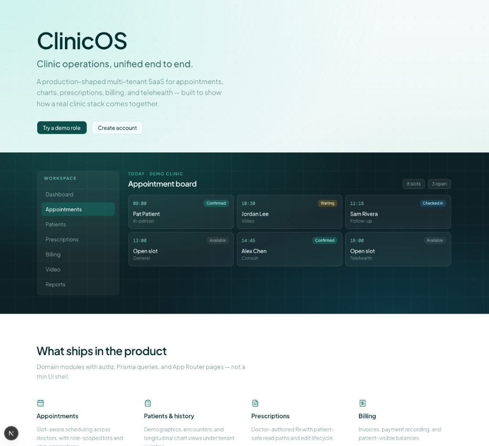
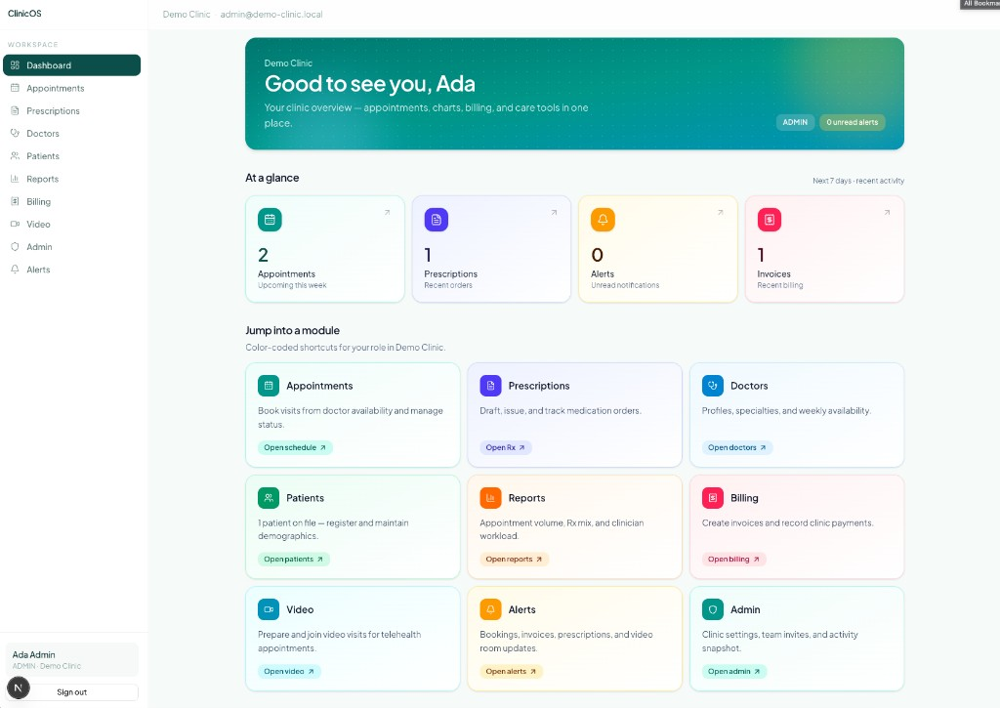
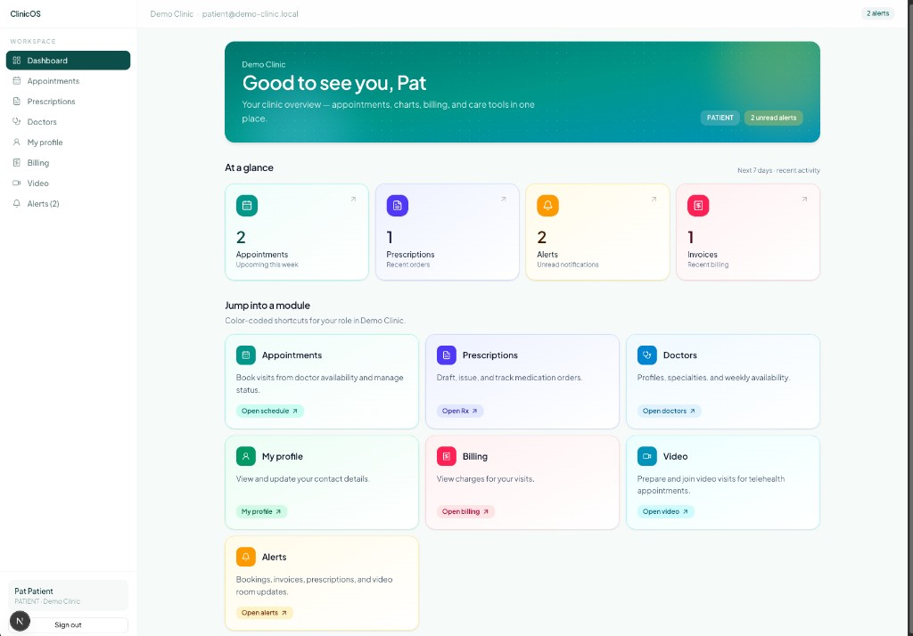

# ClinicOS

Production-oriented Healthcare SaaS (Clinic Operating System) built with Next.js, TypeScript, Tailwind CSS, shadcn/ui, Prisma, PostgreSQL, and Better Auth.

## Screenshots

### Landing page



### Admin dashboard



### Patient portal



## Current phase

**Phase 16 — Testing & Optimization** is complete. See [docs/phase-16-testing-optimization.md](docs/phase-16-testing-optimization.md).

## Getting started

```bash
pnpm install
pnpm dev
```

## Scripts

| Command | Description |
|---------|-------------|
| `pnpm dev` | Start development server |
| `pnpm build` | Production build |
| `pnpm start` | Run production server |
| `pnpm lint` | ESLint |
| `pnpm typecheck` | TypeScript (`tsc --noEmit`) |
| `pnpm test` | Unit tests (Vitest) |
| `pnpm test:watch` | Vitest watch mode |

## Stack

Next.js App Router · TypeScript · Tailwind CSS · shadcn/ui · Redux Toolkit · React Hook Form · Zod · Framer Motion · Prisma · Better Auth · PostgreSQL · Vitest
