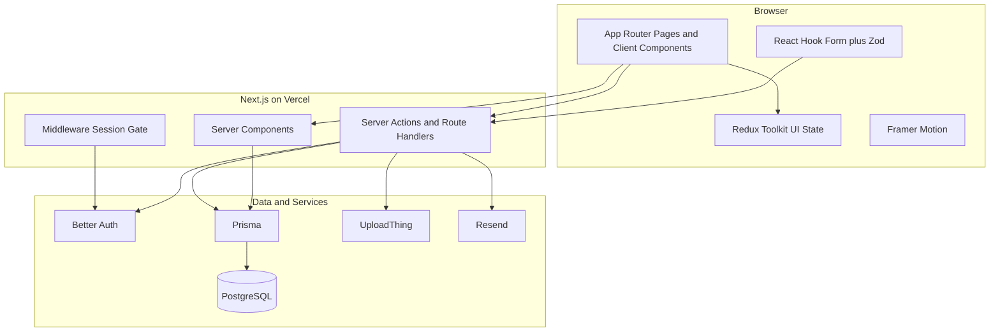

# Phase 1 — Planning & System Design

**Product:** HealthCare SaaS (Clinic OS)  
**Status:** Locked for implementation (pending your approval to start Phase 2)  
**Decisions locked:** Hybrid multi-tenancy + Clinic OS positioning  
**Stack:** Next.js App Router · TypeScript · Tailwind · shadcn/ui · Prisma · PostgreSQL · Better Auth · Redux Toolkit · React Hook Form · Zod · Framer Motion · UploadThing · Resend · Vercel

---

## 1. Product Brief

### Problem

Small and mid-size clinics still run on fragmented tools: phone booking, paper charts, WhatsApp reminders, and spreadsheets for billing. Staff lose time reconciling schedules; patients lack a clear portal; doctors lack a single place for appointments, prescriptions, and history.

### Solution

A **Clinic Operating System** — one web app where:

- **Clinic admins** configure the practice, staff, and billing
- **Reception / staff** manage the front desk schedule
- **Doctors** run their day: appointments, notes, prescriptions
- **Patients** book visits, view history, and join video consults (later phase)

### Positioning (locked)

**Clinic OS** (not a telehealth marketplace, not a specialty-only EMR).

Video consultation, AI features, and deep billing come in later phases — they are not required for the first vertical slice.

### Audience for this codebase

| Audience | What they need |
|----------|----------------|
| ThemeForest buyers | Clean UI, documented setup, demo data, no vendor lock-in on auth |
| Portfolio / remote jobs | Real architecture, tenancy-aware schema, security-minded code |
| Production deploy | Vercel + managed Postgres; env-based config; no fake secrets |

### MVP vs later (aligned to your phases)

| Include early (Phases 2–8) | Defer (Phases 9–15+) |
|----------------------------|----------------------|
| Auth, roles, clinic/tenant | Full medical history depth |
| Doctor & patient profiles | Advanced reports / analytics |
| Appointments | Complex billing / insurance |
| Basic prescriptions | Video consult, AI, rich notifications |
| Admin shell | ThemeForest packaging polish |

---

## 2. Product Model — Hybrid Multi-Tenancy (locked)

### Why Hybrid (not pure single-clinic, not full SaaS day one)

| Approach | Pros | Cons |
|----------|------|------|
| Pure multi-tenant SaaS | Real SaaS story | Heavier onboarding, billing for tenants, ThemeForest buyers may not need it |
| Single-clinic template | Fastest ThemeForest path | Painful rewrite if you productize later |
| **Hybrid (chosen)** | Demo = one clinic; schema has `tenantId`; portfolio shows SaaS thinking | Slightly more discipline on every query |

### How Hybrid works in practice

1. Every clinic-scoped row carries `tenantId` (organization / clinic id).
2. Demo and ThemeForest default: **one seeded tenant**.
3. All Prisma queries for clinic data **must** filter by `tenantId` from the session (never trust client-supplied tenant alone).
4. Platform-level roles (optional later): `SUPER_ADMIN` for multi-clinic ops — not required for MVP UI.

### Common mistake to avoid

Forgetting `tenantId` on a new table or query → **cross-tenant data leaks**. Treat tenancy as a security boundary from Phase 3 onward.

---

## 3. Roles & Permission Matrix

### Roles (MVP)

| Role | Who | Primary jobs |
|------|-----|--------------|
| `ADMIN` | Clinic owner / practice manager | Users, settings, billing config, oversight |
| `RECEPTIONIST` | Front desk | Schedule, check-in, patient registration |
| `DOCTOR` | Clinician | Own schedule, encounters, prescriptions |
| `PATIENT` | End user | Book, view own records, messages/notifications later |

### Permission matrix (high level)

| Capability | Admin | Receptionist | Doctor | Patient |
|------------|:-----:|:------------:|:------:|:-------:|
| Manage clinic settings | Yes | — | — | — |
| Invite/manage staff | Yes | — | — | — |
| Register patients | Yes | Yes | Limited | — |
| View all appointments (clinic) | Yes | Yes | Own (+ assigned) | Own |
| Create/edit appointments | Yes | Yes | Own slots | Request/book |
| Clinical notes / Rx | — | — | Yes (assigned) | View own |
| Billing admin | Yes | Limited | — | Pay own |
| Reports (clinic) | Yes | Limited | Own metrics | — |

### Why include Receptionist

Clinic OS demos on ThemeForest feel incomplete with only Admin/Doctor/Patient. Front-desk flow is the real daily loop. If scope must shrink later, Receptionist can share Admin appointment permissions — but the **role remains in the schema**.

### Authorization approach (Phase 4+)

- Role stored on membership: `User` ↔ `TenantMembership` (`role`, `tenantId`)
- Server-side checks in Server Actions / route handlers (never UI-only)
- Optional later: fine-grained permissions table; MVP uses role checks

---

## 4. Domain Map

Modules match your phase order. Entities below are **conceptual** for Phase 3 schema design — not implemented yet.

```text
Tenant (Clinic)
 ├── Membership (User + Role)
 ├── DoctorProfile
 ├── PatientProfile
 ├── Appointment
 ├── Prescription (+ items)
 ├── MedicalHistory / Encounter notes
 ├── Invoice / Payment (billing)
 ├── ConsultationSession (video)
 └── Notification
```

### Module boundaries

| Module | Owns | Depends on |
|--------|------|------------|
| **Auth & Tenancy** | User, Session, Membership | — |
| **Doctor** | DoctorProfile, specialty, availability | Auth |
| **Patient** | PatientProfile, demographics | Auth |
| **Appointment** | Booking, status, slots | Doctor, Patient |
| **Prescription** | Rx, medications | Appointment/Encounter, Doctor, Patient |
| **Medical History** | Conditions, allergies, visit notes | Patient, Doctor |
| **Reports** | Aggregations / exports | All clinical modules |
| **Billing** | Invoices, payments | Appointment, Patient |
| **Video** | Session tokens, links | Appointment |
| **Notifications** | Email/in-app events | Auth, domain events |
| **AI** | Assistive features only | Clinical context (read) |
| **Admin** | Settings, users, audit views | Tenancy |

### Feature-based folder structure (target)

```text
src/
  app/                    # Next.js routes (thin)
  features/
    auth/
    doctors/
    patients/
    appointments/
    prescriptions/
    ...
  components/             # shared UI (shadcn + layout)
  lib/                    # db, auth client, utils
  store/                  # Redux Toolkit slices (UI state)
```

**Why feature-based:** ThemeForest and portfolio reviewers navigate by domain. Avoid dumping everything under `components/` or giant `services/` folders.

---

## 5. Architecture Overview



### Layering rules

1. **UI** — presentational + feature hooks; no raw Prisma in client components.
2. **Server Actions / Route Handlers** — validate with Zod, authz, call domain functions.
3. **Domain / feature libs** — business rules (e.g. “cannot book past slot”).
4. **Prisma** — persistence only; keep queries in feature `*.repository.ts` or `*.db.ts` files.
5. **Redux Toolkit** — UI state (modals, wizard steps, filters). Prefer Server Components + revalidation for server data; do not mirror the whole DB in Redux.

### Why this split

| Concern | Tool | Why |
|---------|------|-----|
| Auth sessions | Better Auth | Self-hosted, ThemeForest-friendly |
| Validation | Zod (+ RHF) | Same schema client and server |
| Styling | Tailwind + shadcn | Premium, consistent, accessible primitives |
| Motion | Framer Motion | ThemeForest polish — intentional, not noisy |
| Files | UploadThing | Fits Next.js; no custom S3 boilerplate in MVP |
| Email | Resend | Simple transactional email API |
| Hosting | Vercel | Matches App Router deployment model |

### Performance considerations (design-time)

- Default to Server Components; client islands only where needed (forms, motion, charts).
- Paginate lists (appointments, patients); never unbounded clinic-wide fetches.
- Index foreign keys and common filters (`tenantId`, `doctorId`, `startAt`).
- Avoid Redis for now — use DB + Vercel caching / `revalidatePath` patterns.

### Security considerations (design-time)

- Env secrets never committed; stop and request real values when a phase needs them.
- All mutations authenticated + authorized + tenant-scoped.
- Zod on every input boundary.
- PHI-aware logging: no patient names/IDs in client analytics blindly.
- UploadThing: restrict file types/sizes; associate files to tenant + patient.

---

## 6. Auth Recommendation — Better Auth (locked)

### Comparison

| Option | Pros | Cons | ThemeForest fit |
|--------|------|------|-----------------|
| **Better Auth** | Self-hosted, Prisma adapter, organizations/plugins, email/password + OAuth, no per-seat SaaS fee for buyers | Younger ecosystem than Auth.js; you own security updates | **Best** — buyers run without Clerk keys |
| Auth.js (NextAuth) | Mature, many providers | More DIY for orgs/roles; config sprawl | Good |
| Clerk | Excellent DX, UI components | Vendor lock, cost, buyers need Clerk account | Weak for ThemeForest |

### Decision

**Use Better Auth** with:

- Email/password for demo accounts
- Prisma adapter against our PostgreSQL
- Session cookies (httpOnly)
- Role via `TenantMembership`, not only a string on `User` (users can belong to one tenant in MVP; schema allows more later)

### Alternatives we rejected (for now)

- **Clerk** — faster for pure SaaS portfolio, worse for ThemeForest redistribution.
- **Custom JWT-from-scratch** — common junior mistake; skip.

---

## 7. Non-Goals (MVP / until you ask)

- Docker / local container orchestration
- Redis / custom job queues
- Full hospital EMR / FHIR / HL7 interoperability
- HIPAA certification / BAA legal program (see §8)
- Native mobile apps
- Multi-region active-active DB
- Insurance claims clearinghouse
- Real-time collaborative charting

---

## 8. Risk & Compliance Notes

This product will handle **health-related data**. For portfolio and ThemeForest:

| Do | Don't |
|----|-------|
| Encrypt in transit (HTTPS) | Claim “HIPAA certified” without legal/process work |
| Access control + audit-friendly design | Log PHI to third-party debug tools casually |
| Document data handling for buyers | Ship production medical use without compliance review |
| Use demo/synthetic data in public demos | Use real patient data in screenshots |

**Honest framing:** Architecture can be *HIPAA-aware* (access control, encryption, minimal logging). **Certification** is organizational (BAAs with Vercel/DB/email vendors, policies, etc.) — out of scope for Phase 1–17 engineering unless you explicitly expand scope.

---

## 9. Environment Variables Policy

When a phase first needs a secret or connection string:

1. Stop implementation at that gate.
2. Name the variable and where to obtain it.
3. Wait for you to provide the value.
4. Never invent placeholder production secrets in committed files.

Expected later (not created now): `DATABASE_URL`, Better Auth secret/URL, `RESEND_API_KEY`, UploadThing keys, OAuth client IDs if enabled.

---

## 10. Phase Gate

| Item | Status |
|------|--------|
| Product model: Hybrid tenancy | Locked |
| Positioning: Clinic OS | Locked |
| Roles: Admin, Receptionist, Doctor, Patient | Locked |
| Auth: Better Auth | Locked |
| Stack as specified | Locked |
| Code / scaffolding | **Not started** |

**Next phase:** Phase 2 — Project Setup (Next.js, Tailwind, shadcn, folder structure, tooling).

**Do not start Phase 2 until you explicitly approve Phase 1.**

---

## Mentoring appendix — trade-offs we accepted

1. **Hybrid tenancy adds query discipline** in exchange for not rewriting the schema when you productize.
2. **Receptionist role** adds a bit of authz complexity in exchange for a believable clinic demo.
3. **Better Auth over Clerk** trades some hosted DX for redistribution and ownership.
4. **RTK for UI only** avoids the classic mistake of duplicating server state in Redux while still matching your required stack.
5. **No Redis** keeps ops simple on Vercel; background work later can use Vercel cron / queue products if needed — not inventing infra early.
